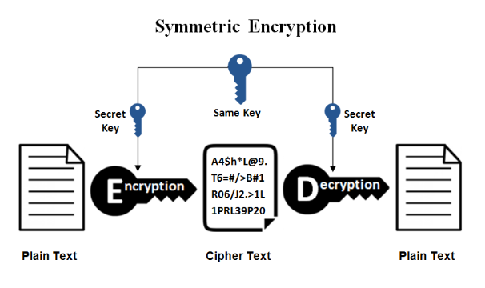
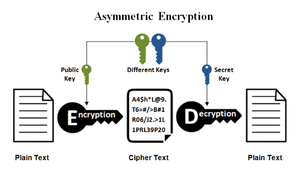
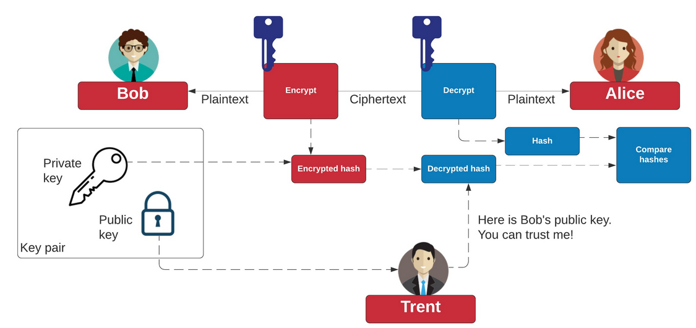

# Class 30-10-2023

## Secure the Network Connections using SSL/TLS
- Identify Security Risks
- Secure Communication
- Preparation of Everything Necessary
- Reconfigure the IoT System to use mqttbroker
- Create Certificates and use Certificates

### Identify Security Risks

#### Tasks (group): Analyse your IoT secnarious for vulnerabilities
- Which Security vulnerabilities did you encounter in your IoT scenarious?
    - No encrypted data transfer.
    - Only available when connected to the local network.
    - No security on the MQTT broker.
    - Not disclosing the IP address
- Which measures can be taken to close the vulnerabilities?
    - **Data Transfer:** Encrypt the data with a hash before sending the data to the MQTT broker. And decrypt it after receiving it at the receiver.
    - **Local Network Connection:** Using a VPN service to connect to the local network when not connected to it.
    - **MQTT broker not secured:** Changing the default port of MQTT, lock the broker behind a login screen with strong credentials, like a password of 16 characters with lower case, big letters, numbers and symbols.
    - **No disclosed IP:** Hash the IP address of the receiver before sending the data from the sender. Don't let devices communicate directly, by configuring the ap.

### Symmetric Encryption
Symmetric encryption uses a single key for both encryption and decryption, ensuring fast processing but requiring secure key distribution. This is the model of symmetric encryption:

### Asymmetric Encryption
Asymmetric encryption relies on a pair of keys, public and private, allowing secure communication without the need for a secure key exchange, but it's slower than symmetric encryption due to the complexity of managing key pairs. This is the model of a symmetric encryption:

### SSL and TLS: Secure Socket Layer/Transport Layer Security

- SSL/TLS supports both, symmetric and asymmetric encryption
- Uses certificates for authentication and encryption.
- A certificate contains
    - A public key
    - Certificate informations ("Identity" information about the user, such as name, user ID, and so on)
    - Information about the domain the certificate is intented for in the subject alternative name (SAN) section.
    - A digital signature from a certificate authority (CA).
- To each certificate a private key exists which can be protected using a password.
- The public key of a certificate and its private key form a public/private key pair.
    - -->The private key and its password shall be kept extremely safe.

### Chain of Trust: SSL/TLS
#### Tasks (individually/group):
- **What is a chipher suit?** A cipher suite is a set of cryptographic algorithms that determine the security parameters for network communication.
- **What is a chain of trust?** A chain of trust refers to a series of certificates that vouch for the authenticity of entities in a network.
- **What is the root certificate authority (CA)?** The root certificate authority (CA) is the top-most entity in a chain of trust that issues digital certificates.
- **What is an intermediate certificate authority (ICA)?** An intermediate certificate authority (ICA) is a subordinate to the root CA that can issue certificates on behalf of the root CA.
- **What is an end-user certificate?** An end-user certificate is a digital certificate issued to an end-user to authenticate their identity.
- **What topological structure of certificates is created by a CA?** The topological structure of certificates created by a CA is a hierarchical structure, resembling a tree.
- **What is the depth of a certificate?** The depth of a certificate refers to its position within the chain of trust, counting from the root.
- **The CA chain of trust is a representative for the trust chain type root of trust**
    - **What ist the name of an other prominent representative of a chain of trust?** The web of trust is another prominent representative of a chain of trust.
    - **How do root of trust and web of trust differ?** Root of trust represents a centralized, hierarchical trust model, whereas web of trust represents a decentralized, peer-based trust model.
    - **Which one is more secure?** Neither is inherently more secure, as their security depends on the specific implementation and use case.

### Diffie-Hellman Key Exchange

Diffie-Hellman (DH) key exchange is used in many symmetric encryption algorithms.

#### Tasks (individually):
- How are Diffie-Hellman key exchange and SSL/TLS related?
    - The Diffie-Hellman key exchange algorithm is used within SSL/TLS protocols to enable secure communication between a client and a server. It facilitates the secure exchange of encryption keys, allowing both parties to create a shared secret key over an insecure channel. This shared key is then used to encrypt and decrypt data, ensuring that sensitive information remains confidential and protected during transmission.

### RSA Key Exchange

Rivest–Shamir–Adleman (RSA) key exchange is used in many asymmetric encryption algorithms.

#### Tasks (individually):

- How are RSA key exchange and SSL/TLS related?
    - RSA key exchange is a cryptographic algorithm used for secure data transmission. In the context of SSL/TLS, RSA key exchange is utilized for secure communication between a client and a server, allowing them to establish a secure connection and encrypt data exchanged over the internet. This method ensures that sensitive information remains confidential and protected from unauthorized access during transmission.

### GA in IT | IoT | Secure the Network Connections using SSL/TLS | Secure Communication Encrypted Communication

To secure an e.g. TCP connection . . .
- Bob (the client) contacts Alice (the server).
- At the very beginning Alice sends its server certificate signed by the certificate authority EXCA to Bob.
- Bob also sends a certificate to Alice. In case no client certificate is configured for Bob a public/private key pair is generated randomly.
- Bob can now prove the validity of Alices certificate if he is tolled so (depends on configuration):
    - If Bob trusts certificate authority EXCA than its CA certificate (public key) is knowen by Bob. E.g. it is installed on the system and made been knowen to Bob by the administrator.
    - Bob can now use the EXCA certificate to validate the certificate of Alice.
    - If Alice certificate is proven valid than Bob can trust Alice,
- In case Bob didn’t trust Alice certificate he shall terminate the connection.
- In case Bob trusts Alice he can use Alice public key and his private key for encryption.
- In that case also Alice can now use Bobs public key and her private key for encryption.

The Bob and Alice conversation:

### Symmetric validation

The previous scenario uses asymmetric validation. Only Bob validates the certificate of Alice. For that . . .
- Alex must have a certificate signed by CA EXCA and a corresponding private kex and send the certificate (only the certificate) to Bob.
- Bob uses EXCAs certificate to validate Alices certificate. No concrete client certificate and private key is necessary on Bobs side.

#### Task (group):

- **What forces Bob to validate Alices certificate?** Bob is obliged to validate Alice's certificate to ensure that the communication between them remains secure and that the entity with whom he is communicating is indeed the legitimate owner of the certificate.
- **Is it possible to also force Alice to validate Bobs identity?** It is also possible for Alice to validate Bob's identity. For this, Bob needs to provide his own certificate signed by a trusted Certificate Authority (CA) to Alice. Upon receiving Bob's certificate, Alice can use the CA's certificate to verify the authenticity of Bob's identity.
- **Which additinal certificates are necessary?** In addition to the certificates of Alice and Bob, a CA certificate signed by a trusted third-party Certificate Authority (CA) is necessary for both parties. This CA certificate is required to verify the authenticity of the certificates exchanged between Alice and Bob, ensuring the legitimacy of the entities involved in the communication.

