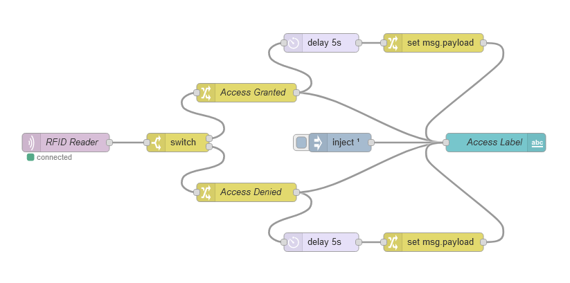
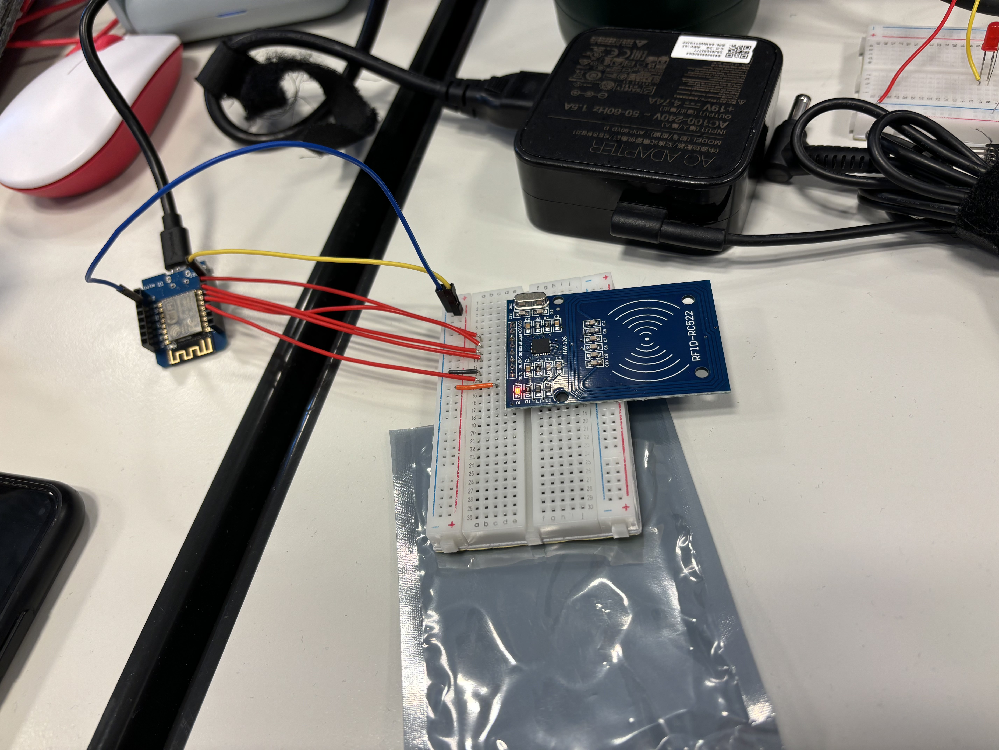
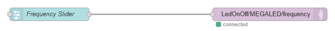
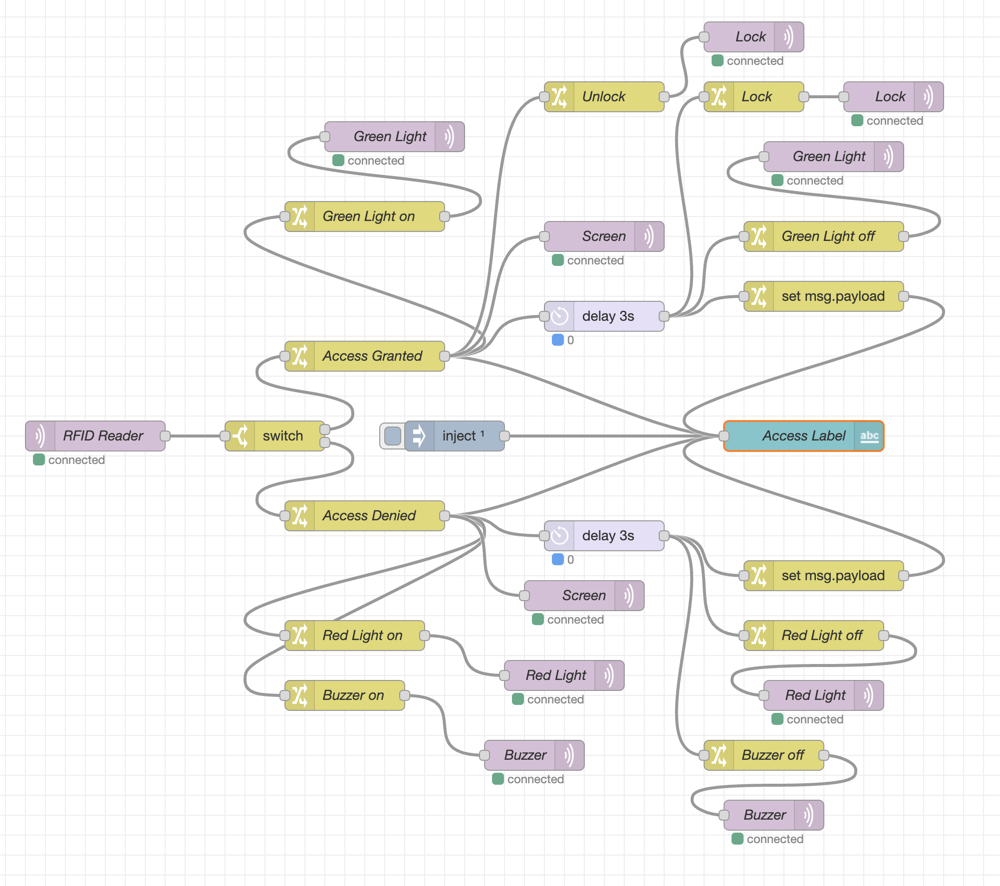

# Lab 23-10-2023

## RFID Sensor

First we started to setup the RFID sensor we got during class. We hooked it up to the Wemos D1 Mini. We hooked it up so it would be the same as the documentation of IoTempower:
```css
Wemos
D1 Mini/    mfrc522/
NodeMCU  -  rfid-rc522 board

    3V3  -  3.3V
     D8  -  sda
     D7  -  MOSI
     D6  -  MISO
     D5  -  SCK
     D0  -  RST
      G  -  GND
    N/C  -  IRQ (IRQ is not connected for use in IoTempower)
```

Next we used the example code in the IoTempower gui that will be uploaded to the Wemos D1 Mini. This is the code that we used:
```css
mfrc522(reader);
```
After we uploaded the code to the D1 Mini we made an Node-Red flow that picks up the RFID signal and posts it. It will also display in Node-Red if access is accepted or access is denied. This is the flow we made:



Next we hooked everything up like in the picture below and it started to work right away.



## Light and Buzzer.

The next task was to make a brightness slider for a LED to burn brighter or less bright. So we hooked up a LED to the esp32 and uploaded the code for it, from the IoTempower gui:

```css
pwm(red, 4, 2000);
```

Next we made the flow for the light in Node-Red. It looks like this:


And we runned the slider left to right and this was the result of it.

Videovideovideovideo

Next we needed to make the buzzer go louder or softer with a slider. It is the same principle for the buzzer. Only the topic we change to buzzer so it is clear it is the buzzer. So the code looks like this:

```css
pwm(buzzer, 4, 2000)   
```

So next we made the flow in Node-Red, which is the same as the slider for the light. It only sends to a different topic.



And next we tested if it would work, and this was the result:

videovideovideo


## Lock project.

The final project was a lock project. in this project we needed to make a lock go open or stay closed if the RFID sensor would read a good code or a bad one. Also we need to turn on a green light if the lock is open and a red light and buzzer if the RFID signal is bad. Also the OLED screen needs to pring access granted or access denied depending on the signal. The lock also needs to close after a certain amount of time.

First we started gathering the items we needed for this project and started on connecting everything to the esp32s. When we connected everything we started with making the directories and uploading the code for the different aspects of the project.

### Lights and buzzer.

First we connected the lights and buzzer to a esp32. We used the stop light to make sure we would see the green light turn on. In the IoTempower gui we used this code for the lights and buzzer:

```css
led(red, 4, "on", "off");
led(green, 27, "on", "off");
pwm(buzzer, 2, 5000);
```

### RFID.

The RFID we hooked up to a D1 Mini just like the RFID in the first part of this lab document. Also we used the same code as the first part:

```css
mfrc522(reader);
```

### OLED screen.
The OLED screen we plugged in a esp32 and also made the code. We used the example code from the IoTempower gui:

```css
U8G2_SSD1306_64X48_ER_F_HW_I2C u8g2(U8G2_R0); // R0 no rotation, R1 - 90°
display(oled, u8g2, font_tiny);
```

### Lock.
Next we hooked up the lock to extra power and an esp32. This is needed, because 5V isn't enough to power it. After it was hooked up we used a simple output code to run the lock:

```css
led(lock, D1, "unlock", "lock").inverted();
```


### Flow.
When all the code has been uploaded to the esp32s we can make the flow, so it will all talk to eachother. The flow is quite big and it looks like this right now:



### Running of the project.

Next we can test the project by using the rfid card and tag. This video shows the functionality of the project:

videovideovideo


