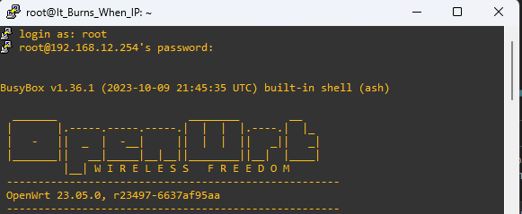
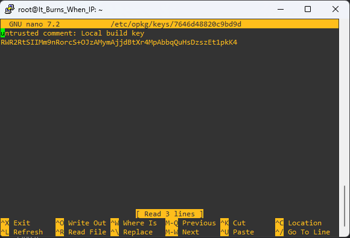
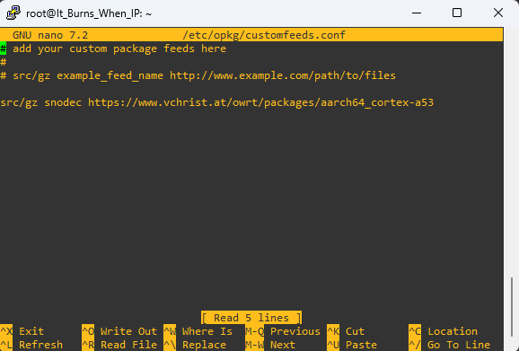
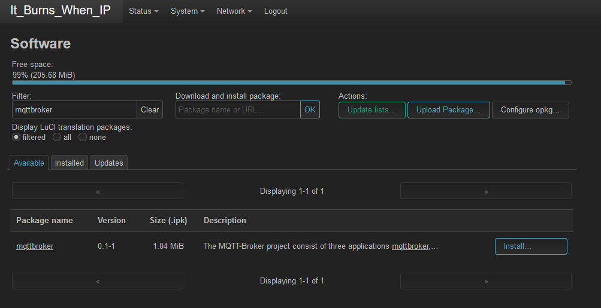
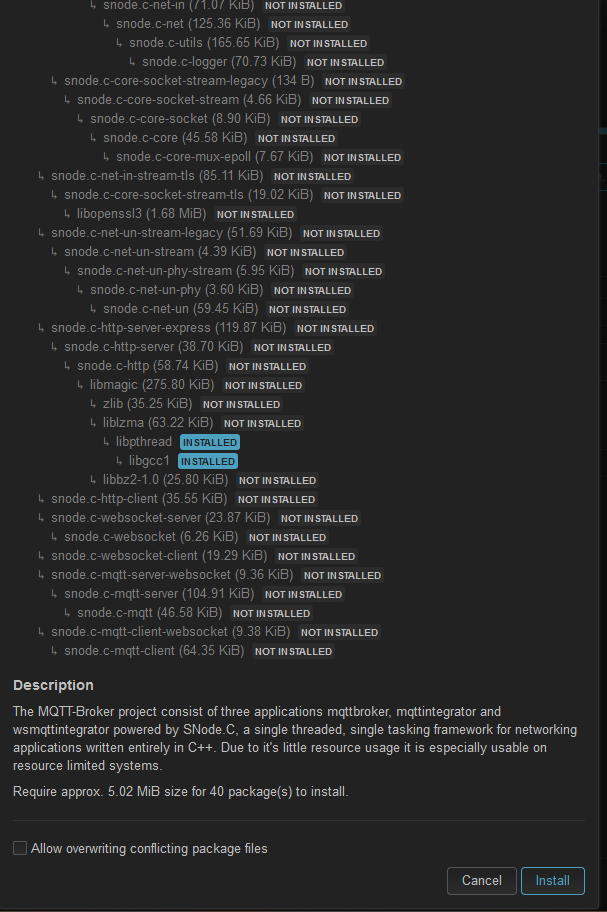
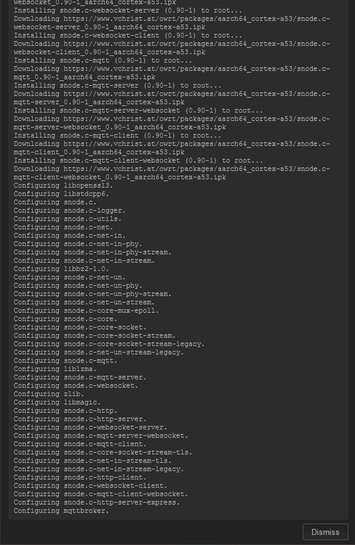
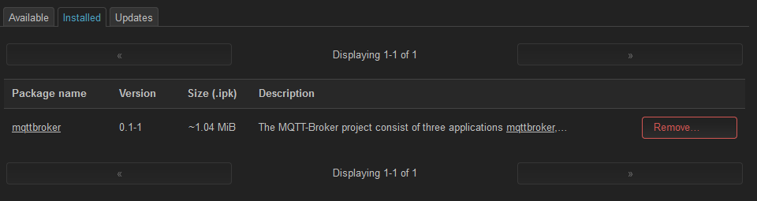
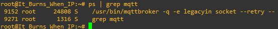

# Lab 30-10-2023

## Individual tasks: Explore OpenWrt.
I talked to Volker about the individual tasks that needs to be done as lab. I have done those kind of tasks multiple times during my time at Fontys, so I will only answer the question:
- Where are the remote package repositories configured?
    - The remot packages are configured under System>Software>Available.

## Group task: Add Package Repository to OpenWRT

Firstly we connected with PuTTY to the router at 192.168.12.254"



Next we needed to download an add the file 7646d48820c9bd9d to the directory: /etc/opkg/keys/ in the router. We made a new file with this name using nano to this directory en used the contents of the file that needed to be added. We got the content from here: https://www.vchrist.at/owrt/.



Next we needed to add the line: ```src/gz snodec https://www.vchrist.at/owrt/packages/aarch64_cortex-a53``` to the customfeeds.conf file in the directory /etc/opkg/customfeeds.conf in the router. This will point to the previously made file.



After this is saved we went to the software tab in the WEB interface of the router to install the mqtt broker. This is found in system>software. In the tab available we searched for mqttbroker and found this package.



After we hit install we got this window, with all the packages that need to install when the mqttbroker package is being installed.



We clicked on install and this is how the installation went.



After the installer shows *Configuring mqttbroker.* we can close this window and check the installed packages. In the picture below you can see that the MQTT-Broker has been installed.



As a final test, in the PuTTY session we looked mqtt up with the command: ```ps | grep mqtt``` and it showed this:

