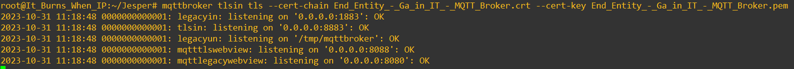
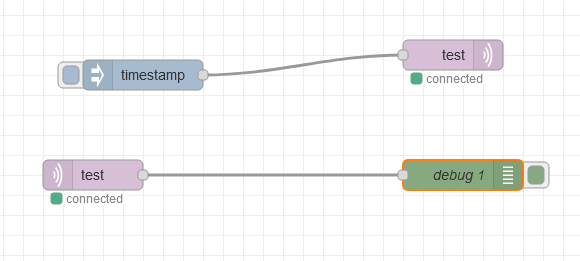
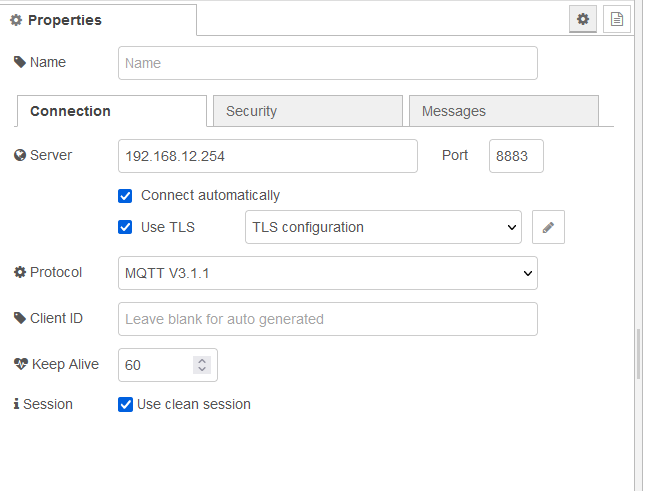
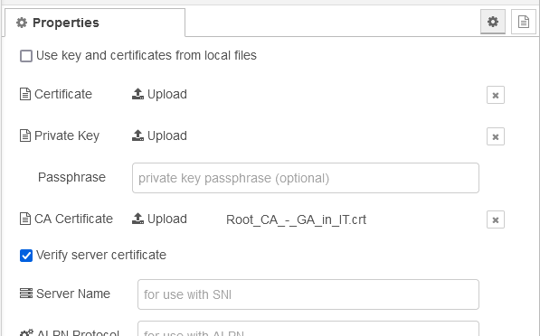
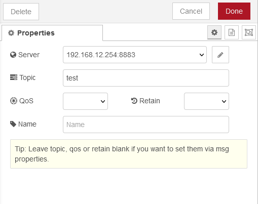
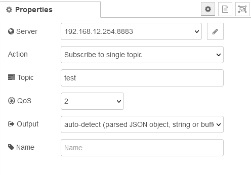
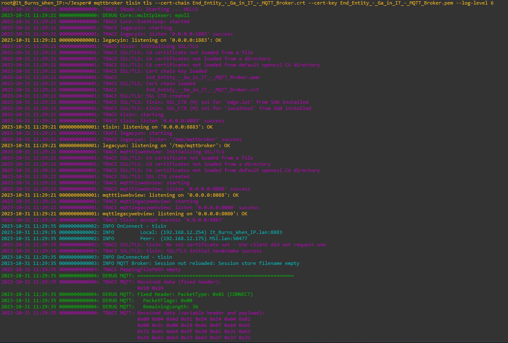
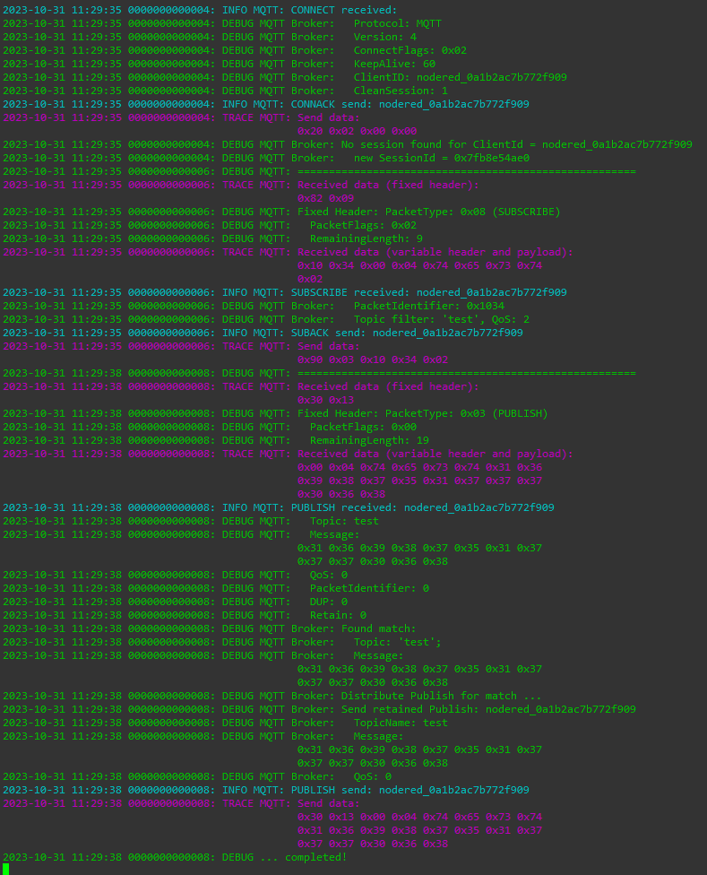
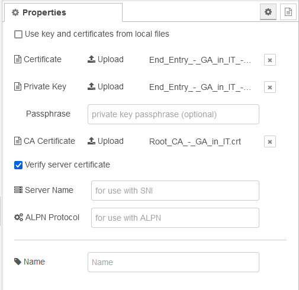
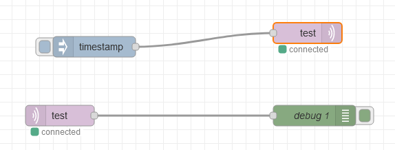

# Lab 31-10-2023

I undertook these steps to generate certificates:

## CA certificate.
After downloading XCA I created a new database in the application and started to create the CA certificate.
I filled this in at the subject:


Then generated a new key:


next in extensions I changed the type to Certification Authority:


In the tab Key usage I clicked on Certificate sign and CRL sign to use these in the certificate:


And Advanced I checked if it would work:


Next I clicked on OK and this window popped up:


Next I checked the Private keys and there is a root CA key now.


Next I exported the certificate, this gave an error at first, but I changed later the directory it needs to be saved in:


## broker certificate
After the CA certificate had been made, the broker certificate kan be made. I used these subject settings and also generated a new key:


The private key has ben created:


Next in extensions I edited the X509 Subject Alternative Name to this:


After applying it, I changed the type to End Entity in the extensions tab.


I checked everything in the advanced tab:


I clicked on OK and the certificate was generated succesfully:


Now in the certificates tab there is an End Entity in the Root CA.


I exported the End Entity to the same directory:


And also exported the public key of the End Entity:


I checked if everything was there in my file folder:


## Install cert on Firefox

Install the root CA certificate on your webbrowser.
- Open Firefox and go to Options:
- Click Privacy & Security in the left-hand menu and scroll down to Certificates.
- Click View Certificates... and the Certificate Manager window displays.
- Click Authorities and then Import....
- Browse to locate the downloaded ca. ...
- Click OK.


## Running the certificate on the router
Using winscp transferred certificate files to the router in a directory named Jesper.


Firstly I needed to turn of the mqttbroker: */etc/init.d/mqttbroker stop*.

Next used this command next in ssh:

```css
mqttbroker mqtttlswebview tls --cert-chain End_Entity_-_GA_it_in_IT_-_MQTT_Broker.crt --cert-key End_Entity_-_GA_it_in_IT_-_MQTT_Broker.pem
```
This happened:


Went to https://192.168.12.254:8088/clients/


Went to more information and this is the certificate:


And this is PuTTY output:


## Node-Red


mqttbroker mqtttlswebview tls --cert-chain End_Entity_-_Ga_in_IT_-_MQTT_Broker.crt --cert-key End_Entity_-_Ga_in_IT_-_MQTT_Broker.pem













sender



receiver










Certificate and key for Node-Red

First mad a new certificate for Node-Red in XCA:


Then uploaded it to Node red in the mqtt publisher: *Server>TLS configuration*



Node-Red flow still connected



