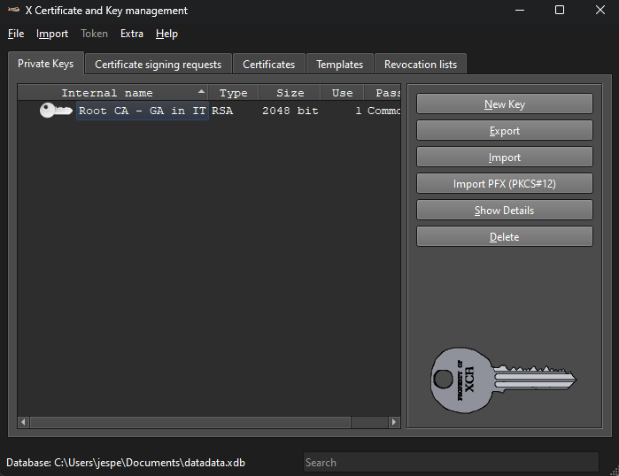

# Lab 31-10-2023

I undertook these steps to generate certificates:

## CA certificate.
After downloading XCA I created a new database in the application and started to create the CA certificate.
I filled this in at the subject:


Then generated a new key:


next in extensions I changed the type to Certification Authority:


In the tab Key usage I clicked on Certificate sign and CRL sign to use these in the certificate:


And Advanced I checked if it would work:


Next I clicked on OK and this window popped up:


Next I checked the Private keys and there is a root CA key now.



Next I exported the certificate, this gave an error at first, but I changed later the directory it needs to be saved in:


## broker certificate
After the CA certificate had been made, the broker certificate kan be made. I used these subject settings and also generated a new key:


The private key has ben created:


Next in extensions I edited the X509 Subject Alternative Name to this:


After applying it, I changed the type to End Entity in the extensions tab.


I checked everything in the advanced tab:


I clicked on OK and the certificate was generated succesfully:


Now in the certificates tab there is an End Entity in the Root CA.


I exported the End Entity to the same directory:


And also exported the public key of the End Entity:


I checked if everything was there in my file folder:


## Install cert on Firefox

Install the root CA certificate on your webbrowser.
- Open Firefox and go to Options:
- Click Privacy & Security in the left-hand menu and scroll down to Certificates.
- Click View Certificates... and the Certificate Manager window displays.
- Click Authorities and then Import....
- Browse to locate the downloaded ca. ...
- Click OK.


## Running the certificate on the router
Using winscp transferred certificate files to the router in a directory named Jesper.


Firstly I needed to turn of the mqttbroker: */etc/init.d/mqttbroker stop*.

Next used this command next in ssh:

```css
mqttbroker mqtttlswebview tls --cert-chain End_Entity_-_GA_it_in_IT_-_MQTT_Broker.crt --cert-key End_Entity_-_GA_it_in_IT_-_MQTT_Broker.pem
```
This happened:


Went to https://192.168.12.254:8088/clients/


Went to more information and this is the certificate:


And this is PuTTY output:


## Node-Red

First we needed to turn on the mqttbroker again, but this time we needed to turn on the mqtt tls webview. We used this command to turn it on:
```css 
mqttbroker mqtttlswebview tls --cert-chain End_Entity_-_Ga_in_IT_-_MQTT_Broker.crt --cert-key End_Entity_-_Ga_in_IT_-_MQTT_Broker.pem 
```
So the router will turn on the mqtt again. We need to use port 8883 later with Node-Red, this is for TLS.


I hosted Node-Red locally on my laptop so we didn't need to hook up the raspberry pi 400 for Node-Red. After it started up I made a simple flow to showcase that it works. This is the simple flow I made:


Next I setup the MQTT sender. Firstly I added the server and the port to 192.168.12.254 and port 8883. I also turned on use TLS and made a TLS configuration. This is only the properties:


Next up are the TLS configurations. I uploaded the root CA certificate to the Node-Red configuration. Look in the picture below to see it.


This is the final settings of the MQTT sender. It will send a message over the test topic.


Next up the settings for the MQTT receiver. It will listen on the test topic for messages.


After injecting a message in the MQTT sender it wil receive the message and display it on the Node-Red dashboard, the ssh session with the command open will display this:


The Node-Red security assignment only needs to have both ways encrypted traffic. So at the moment it only went one way, because the MQTT broker is encrypted with an certificate. And that is only for the traffic to the MQTT receiver. So I needed to make a new certificate to give to the Node-Red configuration of the MQTT sender.

So first we made a new certificate for Node-Red in XCA:


Then uploaded it to Node red in the mqtt publisher: *Server>TLS configuration*.


After deploying the flow again, you can see it is still connected and when you send a message it still works.


