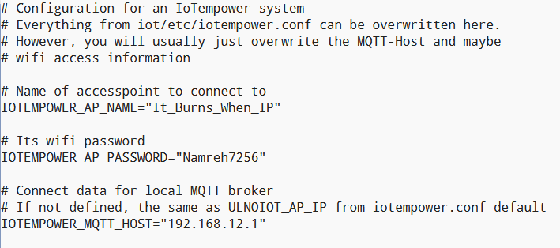

# Lab Day Five

## Flashing the Mini D1 esp32 with the gateway
We started the day with all the esp32's not working. So we had to flash them from the templates that were online. These were the steps we took:
- First we needed to change node.conf.
- It is located in the directory: demo01/test01.
- We changed the default microcontroller to esp32minikit.

After it was saved we needed to flash the microcontrollers. These are the steps we took to flash the esp32's:
- Go to F2.
- Click on Advanced.
- Next initialize serial.
- Click on yes and start the flashing process.

Now the flashing process wil start automatically.

If the flashing process is finished you will see this:

## New Node
The first assignment of the day was to make a button with IoTempower and it would post with MQTT.

In the start we need to add a new node. These are the steps we took to make it work:
- Go to F2,
- Click on make new Node folder.
- Press YES.
- We renamed our directory to ButtonLED.

Next we got our code from the example dictionary of IoTempire gateway. This code needed to be put into the setup.cpp file. We can do this by editing the setup.cpp file.

Next we can save the file and close it. Then we need to upload it to the microcontroller again. This is done the same way as in Flashing the Mini D1 esp32 with the gateway.

Once started it, wait till the upload is complete and close the window.

When we tried to pickup some MQTT signals we found out that it wasn't sending anything to the MQTT broker because of the WiFi. We found out in a SSH session:

So we changed the wifi settings to our WiFi and the MQTT broker IP. This was done in the directory demo01/system.conf.

After we saved the file and resubmitted the code, and now we get MQTT signals when we press the button.

## Node 2
Next we needed to make a second Node that will turn on a light via MQTT on a different esp32. So we made a new node. We made it in a new directory: demo01/LedOnOff/MEGALED/.
Next we edited the setup.cpp file to turn on and off a light on a breadboard.

Next we needed to make a flow in Node-Red, where the input should switch the LED on or off when the button is pressed. The flow below showcases how this wil work. The toggle button will keep the light on after one press and then turn it off after another button press.

This video will showcase this:

## Emergency alarm
The next assigment was to play a sound and a notification if the button is pressed. We build the emergency alarm based on the button press from the first node.

Flow for the emergency text and sound is made in Node-Red for the proof of concept. Part d: Button to Sound Notification is the part of this assignment in the flow below.

If the button is pressed, it wil send a notification to a dashboard which will say Emergency for 5 seconds. Also a sound will be played: "Emergency!" From the speaker.

## Setting up OLED screen.
The last assignment was to use the OLED screen we got and print a message on the screen.

First we needed to link up the OLED screen to the board. And needed to make the directory to put the code on the microcontroller. we put the code in demo01/OLED/Screen_text. See the code below:

Upload the code like the previous times. And wait untill it is powered.
Next we sent Hello to the OLED screen with mqtt send:

Then hello wil pop up on the screen.

We also made the assignment a bit bigger than needed and we added the button from the first node to the assignment. So if the button was pressed it will sent Emergency! to the OLED screen. In the flow below at e: Text Receiver, you can see the flow we made to sent Emergency! to the OLED screen.

Look at the picture below that it says Emergency! on the screen multiple times.

In this video you can also see the result if the button is pressed.

<video src="videos/IMG_9914.mp4" controls title="Title"></video>
