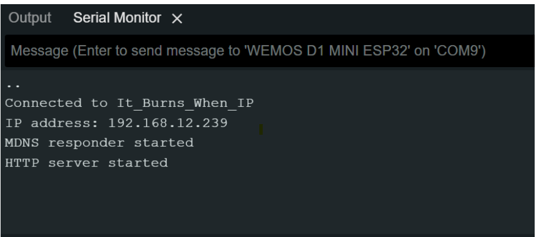
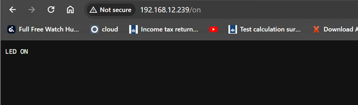
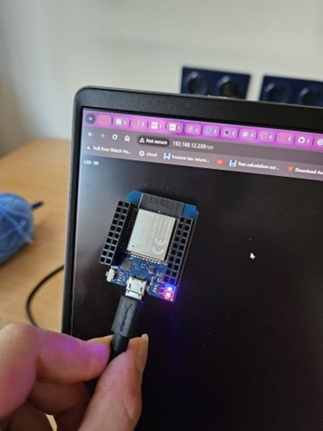
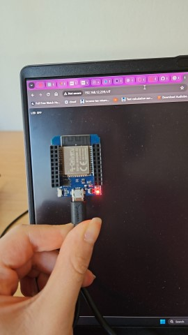
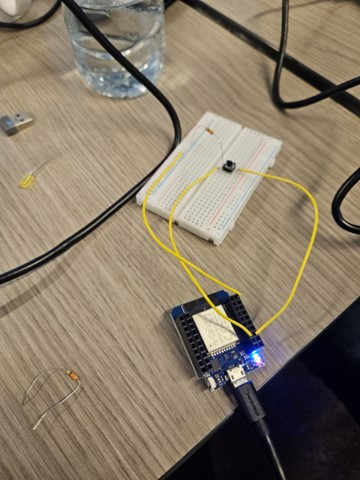

# Lab Tasks Description

# Exercise 02

For the second exercise we wrote the Persona task.

# Stories/Scenario Task

## The Persona


### Introduction

Gary is an industrial designer struggling with navigating his ADHD at work. He struggles with concentration, time management, and external distractions. Despite his best efforts, he often finds himself overwhelmed by a never-ending To-do list. His colleagues Team Rocket decided to help him by developing IoT devices that he can use in the office to stay focused and complete his tasks.

## The Plot

Gary is in the office and checks his to-do list for the day. The list is overwhelmingly long, and he has a meeting to attend in between his personal tasks. He needs to finish the To-do list despite the challenges as he is going on holiday with his wife and two children the next day.

He opens the desktop app – Leveling that has face tracking software installed. The app is connected to IoT device that is a blinker set next to his laptop. The team calls the device Focus Assist Blinker. The tracker of the app follows Gary's eye movements, and when he is not paying attention to the screen, the blinker is activated, and Gary's attention goes back to the screen. Despite the promising results in the office, Gary finds himself challenged when navigating external meetings without the desktop setup.

The team gathers and brainstorms on implementing a solution in the form of a small portable smart band that Gary can wear when he travels to another meeting. Gary is testing the band in his first meeting, and when he is not paying attention to his work, his wrist device starts vibrating and blinking, so he is reminded to refocus.

## Conclusion

The device is a huge success with Gary's productivity levels. The team is inspired to raise awareness for people with ADHD in workplaces and implement the devices with other individuals with similar concentration problems at work.

## IoT (Internet of Things) Architecture

IoT (Internet of Things) architecture involves the interconnection of various components and technologies to enable seamless communication and data exchange between "Things." Below we explain how these concepts are related and provide examples for each group, along with a simplified architecture sketch:

1. **Internet:**
   The Internet serves as the backbone for IoT, enabling Things to connect to each other and external services. It provides the global communication infrastructure. 
   *Example:* Smart thermostats communicating with a weather service over the Internet to adjust heating and cooling based on weather forecasts.

2. **Server:**
   Servers in IoT architecture are responsible for receiving and processing data from Things and often serve as intermediaries between Things and the cloud. 
   *Example:* A server collecting sensor data from multiple smart streetlights to optimize energy usage and monitor their status.

3. **Cloud Computing:**
   Cloud computing resources are used for storage, processing, and analysis of large amounts of IoT data. It offers scalability and accessibility. 
   *Example:* A cloud platform storing and analyzing data from a fleet of autonomous delivery drones.

4. **Edge Computing:**
   Edge computing involves processing data closer to where it's generated (e.g., at the device or gateway), reducing latency and conserving bandwidth. 
   *Example:* A smart security camera using edge computing to identify intruders and send alerts without sending video data to the cloud.

5. **Fog Computing:**
   Fog computing extends edge computing by incorporating more intelligence and processing power at the network's edge. 
   *Example:* An industrial robot in a manufacturing facility using fog computing for real-time monitoring and decision-making.

6. **Swarm:**
   Swarm computing refers to a group of interconnected Things that collaborate to achieve a common goal. It's often used in robotics and distributed systems. 
   *Example:* A swarm of autonomous drones working together for search and rescue missions.

7. **Things:**
   Things are the devices and sensors that collect and transmit data, such as sensors, smart appliances, wearables, and more. 
   *Example:* Smart wearable devices monitoring a person's health and sending data to their healthcare provider.

8. **Gateway:**
   Gateways act as intermediaries between Things and the rest of the IoT architecture, translating between different communication protocols. 
   *Example:* A smart home hub that connects various smart devices (lights, locks, thermostats) and controls them through a single interface.

9. **Nodes:**
   Nodes are individual devices within the IoT network, including both the Things and other components like gateways and servers. 
   *Example:* In an agricultural IoT system, nodes include soil moisture sensors, drones for crop monitoring, and a central control node for decision-making.

Here's a simplified architecture sketch:


# LAB: Control LED with Web Request

## Introduction
We begin the task of running a web server on a microcontroller and sending an HTTP request to turn on and off the built-in light of the ESP32.

## Code
The following code is used in the Arduino IDE and loaded onto the ESP32:

```arduino
#include <WiFi.h>
#include <WiFiClient.h>
#include <WebServer.h>
#include <ESPmDNS.h>
 
const char* ssid = "It_Burns_When_IP";
const char* password = "Namreh7256";
 
WebServer server(80);
 
const int led = 2;
 
void handleRoot() {
  server.send(200, "text/plain", "hello from my friend's ESP32!");
}
 
void handleNotFound() {
  digitalWrite(led, 1);
  String message = "File Not Found\n\n";
  message += "URI: ";
  message += server.uri();
  message += "\nMethod: ";
  message += (server.method() == HTTP_GET) ? "GET" : "POST";
  message += "\nArguments: ";
  message += server.args();
  message += "\n";
  for (uint8_t i = 0; i < server.args(); i++) {
    message += " " + server.argName(i) + ": " + server.arg(i) + "\n";
  }
  server.send(404, "text/plain", message);
  digitalWrite(led, 0);
}
 
void setup(void) {
  pinMode(led, OUTPUT);
  digitalWrite(led, 0);
  Serial.begin(115200);
  WiFi.mode(WIFI_STA);
  WiFi.begin(ssid, password);
  Serial.println("");
 
  // Wait for connection
  while (WiFi.status() != WL_CONNECTED) {
    delay(500);
    Serial.print(".");
  }
  Serial.println("");
  Serial.print("Connected to ");
  Serial.println(ssid);
  Serial.print("IP address: ");
  Serial.println(WiFi.localIP());
 
  if (MDNS.begin("esp32")) {
    Serial.println("MDNS responder started");
  }
 
  server.on("/", handleRoot);
 
  server.on("/on", [](){
    digitalWrite(led, HIGH);
    server.send(200, "text/plain", "LED ON");
  });
 
  server.on("/off", [](){
    digitalWrite(led, LOW);
    server.send(200, "text/plain", "LED OFF");
  });
 
  server.on("/inline", []() {
    server.send(200, "text/plain", "this works as well");
  });
 
  server.onNotFound(handleNotFound);
 
  server.begin();
  Serial.println("HTTP server started");
}
 
void loop(void) {
  server.handleClient();
  delay(2); // allow the CPU to switch to other tasks
}
```

## We check the serial monitor : 




1. We check if the HTTP website is running, so we go to [192.168.12.239](http://192.168.12.239).


2. Then we try [192.168.12.239/on](http://192.168.12.239/on), and the LED is turned on on the board.





3. Next, we try [192.168.12.239/off](http://192.168.12.239/off), and the result is as follows:



## Turning Light On and Off with a Button

The code: 

```cpp
#include <Arduino.h>
#include <String.h>
#include <WiFi.h>
#include <WiFiMulti.h>
#include <HTTPClient.h>
 
#define USE_SERIAL Serial
#define LED 2
#define LEDEXT 18
#define BUTTON 21
 
int currentButtonState;
int lastButtonState;
int ledState;
WiFiMulti wifiMulti;
 
void onFunction();
void offFunction();
 
void setup() {
  USE_SERIAL.begin(115200);
  pinMode(LED, OUTPUT);
  pinMode(LEDEXT, OUTPUT);
  pinMode(BUTTON, INPUT_PULLUP);
  USE_SERIAL.println();
  USE_SERIAL.println();
  USE_SERIAL.println();
 
  for (uint8_t t = 4; t > 0; t--) {
    USE_SERIAL.printf("[SETUP] WAIT %d...\n", t);
    USE_SERIAL.flush();
    delay(1000);
  }
 
  wifiMulti.addAP("It_Burns_When_IP", "Namreh7256");
}
 
void loop() {
  // wait for WiFi connection
  if ((wifiMulti.run() == WL_CONNECTED)) {
  }
 
  lastButtonState = currentButtonState; // save the last state
  currentButtonState = digitalRead(BUTTON); // read new state
 
  if (lastButtonState == HIGH && currentButtonState == LOW) {
    delay(50);
    if (lastButtonState == HIGH && currentButtonState == LOW) {
      Serial.print("The button is pressed: ");
 
      // toggle state of LED
      if (ledState == LOW) {
        ledState = HIGH;
        Serial.println("Turning LED on");
        onFunction();
      } else {
        ledState = LOW;
        Serial.println("Turning LED off");
        offFunction();
      }
    }
    digitalWrite(LEDEXT, ledState);
  }
}
 
void onFunction() {
  HTTPClient http;
  USE_SERIAL.print("[HTTP] begin...\n");
  http.begin("http://192.168.12.189/on"); //HTTP
 
  USE_SERIAL.print("[HTTP] GET...\n");
  int httpCode = http.GET();
 
  if (httpCode > 0) {
    USE_SERIAL.printf("[HTTP] GET... code: %d\n", httpCode);
    if (httpCode == HTTP_CODE_OK) {
      String payload = http.getString();
      USE_SERIAL.println(payload);
    }
  } else {
    USE_SERIAL.printf("[HTTP] GET... failed, error: %s\n", http.errorToString(httpCode).c_str());
  }
  http.end();
}
 
void offFunction() {
  HTTPClient http;
  USE_SERIAL.print("[HTTP] begin...\n");
  http.begin("http://192.168.12.189/off"); //HTTP
 
  USE_SERIAL.print("[HTTP] GET...\n");
  int httpCode = http.GET();
 
  if (httpCode > 0) {
    USE_SERIAL.printf("[HTTP] GET... code: %d\n", httpCode);
    if (httpCode == HTTP_CODE_OK) {
      String payload = http.getString();
      USE_SERIAL.println(payload);
    }
  } else {
    USE_SERIAL.printf("[HTTP] GET... failed, error: %s\n", http.errorToString(httpCode).c_str());
  }
  http.end();
<<<<<<< HEAD
}       
=======
}
```
>>>>>>> 53a69f90ba11efc1f7841a05ac6741fd9530da76

The result is: 


