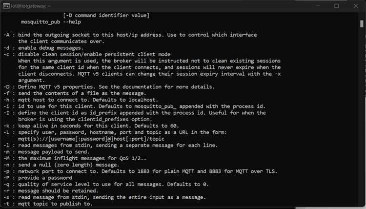
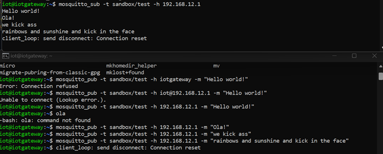
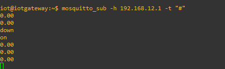
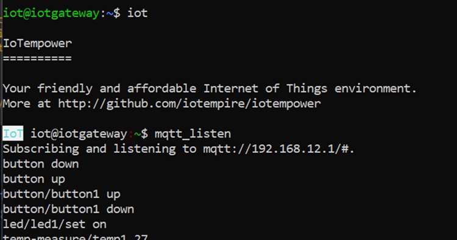
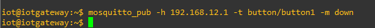
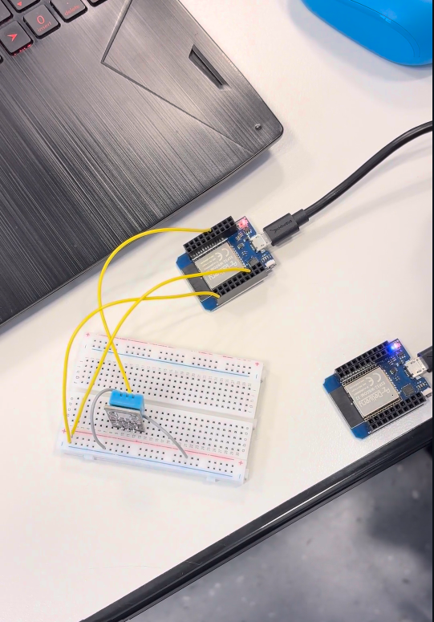

Before we started the exercises, we had to fix the raspberry pi that was crashing a lot with sending the WIFI network. We could not work fully until it was fixed. So after a talk with the teacher, we decided to turn off the WiFi part from the raspberry. This is how we did it after Ulrich was done with changing the raspberry pi settings:

1. Shut down the Raspberry Pi router and then powered it back on.

2. After that, I modified the router LAN address to 192.168.12.254.

3. Upon restarting the Raspberry Pi, I went into the router settings and assigned a static IP address (192.168.12.1) for the Raspberry Pi.

4. I accessed the Raspberry Pi via SSH and used the command "sudo reboot".

5. Now, the Raspberry Pi is assigned the IP address 192.168.12.1.


First exercise

After completing the configuration of the Raspberry Pi, it now has an assigned IP address, which is 192.168.12.1. This IP address is like a unique identifier that allows us to connect to and communicate with the Raspberry Pi on our network.

To set up the MQTT Mosquitto settings on our Raspberry Pi, we need to use SSH. SSH enables us to access our Raspberry Pi remotely, so we can configure the MQTT Mosquitto settings.


To access the message subscription options of Mosquitto, simply use the following command in your terminal:

To access the message subscription options of Mosquitto, simply use the following command in your terminal:

```bash
mosquitto_sub --help
```

Executing this command will present a comprehensive list of available parameters and usage guidelines, facilitating the effective subscription to MQTT messages.


To access Mosquitto's message publishing options, you can employ the following command in your terminal:

```bash
mosquitto_pub --help
```

Running this command will provide a detailed list of available parameters and usage instructions, making it straightforward to publish messages using MQTT.



Sending a message to another client:



Sending messages via MQTT
Listening MQTT messages: 



Receiving and monitoring MQTT messages:



### Testing light on and off

The subsequent step involved the simulation of a compact IoT network. We were required to create a 'temperature sensor' that could transmit temperature data to the MQTT broker. The MQTT broker, in turn, would dispatch a signal to the 'ac' to activate or deactivate it. Prior to configuring it in this manner, I initially set it up to control the activation and deactivation of a light using the code provided on the IoT Knit library's GitHub page. Here's the code: 

```
from iotknit import Device, MQTTBroker

class TemperatureSensor(Device):
    def __init__(self, name):
        super().__init__(name)

    def read_temperature(self):
        # Simulated temperature reading
        temperature = 25
        return temperature

class AC(Device):
    def __init__(self, name):
        super().__init__(name)
        self.is_on = False

    def turn_on(self):
        self.is_on = True
        print(f"{self.name} is turned on.")

    def turn_off(self):
        self.is_on = False
        print(f"{self.name} is turned off.")

class Light(Device):
    def __init__(self, name):
        super().__init__(name)
        self.is_on = False

    def turn_on(self):
        self.is_on = True
        print(f"{self.name} is turned on.")

    def turn_off(self):
        self.is_on = False
        print(f"{self.name} is turned off.")

if __name__ == "__main__":
    # Simulating IoT network
    temp_sensor = TemperatureSensor("TempSensor")
    ac = AC("AC")
    light = Light("Light")

    # Check temperature and control devices
    current_temp = temp_sensor.read_temperature()
    if current_temp > 30:
        ac.turn_on()
    else:
        ac.turn_off()

    if current_temp > 25:
        light.turn_on()
    else:
        light.turn_off()

```

Next thing is to send a message “down” via the mosquito publisher. That sends a turn on command to the receiver as shown below: 



The result in terminal is: 


The mosquito listener is receiving : 


### Turning ac on and off exercise 

The code to implement the temperature sensor and the AC is as follow: 

```

from iotknit import *

init("192.168.12.1")  # use a MQTT broker on localhost

prefix("sensor")  # all devices below are prefixed with /sensor

switch = publisher("ac_control")  # create a Thingi interface that publishes to sensor/ac_control

def tempCallback(msg):
    print("temperature received: ", msg)

    try:
        temperature = int(msg)
    except ValueError:
        return

    if temperature >= 30:
        switch.publish("set", "on")  # publish the updated state
        print("Sending: [ac_control]", "on")
    elif temperature <= 25:
        switch.publish("set", "off")
        print("Sending: [ac_control]", "off")
    else:
        return
temperature_sensor_1 = subscriber("sensor1")  # create a Thingi interface that subscribes to temperature/temperature1
temperature_sensor_1.subscribe_change(callback=tempCallback)

run()  # you can also use a while loop here, calling process() instead

```
### Hardware 

After completing the 'simulation' phase for the temperature sensor and the 'ac', our next step was to implement the hardware setup. For this, we utilized a temperature sensor, two ESP32 devices, and a light for the purpose of activation or deactivation.

Initially, I modified the code to enable the 'ac' to turn on and off effectively. This adjustment was necessary as the server only recognized temperatures above 26, leading to the 'ac' functioning only under that condition. To ensure proper functionality, I revised the code to switch off everything below 27 and activate it above that threshold. This setup allowed us to conduct thorough testing. A crucial alteration involved changing the line 't = int(msg)' to 't = float(msg)' to prevent potential errors. This is the updated version of the code.

```

from iotknit import *

init("localhost")  # use a MQTT broker on localhost

prefix("device")  # all devices below are prefixed with /device

controller = publisher("controller_1")  # create a Thingi interface that publishes to device/controller_1

def temperature_callback(message):
    print("Temperature received: ", message)

    try:
        temperature = float(message)
    except ValueError as e:
        print("Error: ", e)
        return

    if temperature >= 27:
        controller.publish("set", "on")  # publish the updated state
        print("Sending: [controller_1]", "on")
    else:
        controller.publish("set", "off")
        print("Sending: [controller_1]", "off")


prefix("temperature-measure")  # change prefix to temperature-measure

temperature_sensor_1 = subscriber("sensor_1")  # subscribe to the top-level topic "temperature-measure" without any sub-topic
temperature_sensor_1.subscribe_change(callback=temperature_callback)

run()  # you can also use a while loop here, calling process() instead

```
#### Next we made the code for the sender, so this esp32 had the temperature sensor that would sent the temperatures to the MQTT broker. This is the code for it:

```
from iotknit import *

init("192.168.12.1")  # use a MQTT broker on localhost

prefix("control")  # all actors below are prefixed with /control

device_controller = publisher("device_1")  # create a Thingi interface that publishes to control/device_1

def temperature_callback(msg):
    print("Temperature received: ", msg)

    try:
        temp = float(msg)
    except ValueError as e:
        print("Error occurred: ", e)
        return

    if temp >= 27:
        device_controller.publish("set", "on")  # publish the updated state
        print("Sending: [device_1]", "on")
    else:
        device_controller.publish("set", "off")
        print("Sending: [device_1]", "off")


prefix("temperature-sensor")  # change prefix to temperature-sensor

sensor_1 = subscriber("sensor_1")  # subscribe to the top-level topic "temperature-sensor" without any sub-topic
sensor_1.subscribe_change(callback=temperature_callback)

run()  # you can also use a while loop here, calling process() instead
```
#### •	Subsequently, we developed the code for the recipient, which was the other ESP32 device connected to the light, responsible for toggling it on or off based on the temperature. Here is the code that we formulated for this purpose:

```
#include <WiFi.h>
#include <PubSubClient.h>

// WiFi
const char* ssid = "Your_WiFi_Name"; // Enter your Wi-Fi name
const char* password = "Your_WiFi_Password";  // Enter Wi-Fi password

// MQTT Broker
const char* mqtt_broker = "192.168.12.1";
const char* topic_switch = "switch/rl/set";

WiFiClient espClient;
PubSubClient client(espClient);

// Onboard LED
const int ledPin = 2; // Change this to the appropriate GPIO pin where the onboard LED is connected

void setup() {
  Serial.begin(115200);

  // Connecting to a WiFi network
  WiFi.begin(ssid, password);
  while (WiFi.status() != WL_CONNECTED) {
    delay(500);
    Serial.print(".");
  }
  Serial.println("");
  Serial.print("Connected to ");
  Serial.println(ssid);
  Serial.print("IP address: ");
  Serial.println(WiFi.localIP());

  // Initialize LED pin as an output
  pinMode(ledPin, OUTPUT);
  digitalWrite(ledPin, LOW); // Initialize LED as OFF

  // Set the MQTT broker server
  client.setServer(mqtt_broker, 1883);

  // Set the callback function to handle MQTT messages
  client.setCallback(callback);
}

void loop() {
  if (!client.connected()) {
    reconnect();
  }
  client.loop();
}

void callback(char* topic, byte* payload, unsigned int length) {
  // Handle MQTT messages received on the subscribed topic
  if (strcmp(topic, topic_switch) == 0) {
    String message = "";
    for (int i = 0; i < length; i++) {
      message += (char)payload[i];
    }

    if (message == "on") {
      digitalWrite(ledPin, HIGH); // Turn LED ON
    } else if (message == "off") {
      digitalWrite(ledPin, LOW); // Turn LED OFF
    }
  }
}

void reconnect() {
  // Reconnect to the MQTT broker
  while (!client.connected()) {
    if (client.connect("LED Control")) {
      // Subscribe to the switch/rl/set topic
      client.subscribe(topic_switch);
    } else {
      delay(5000);
    }
  }
}
```
### Temperature is set to high 

<video src="../../pictures/activity03/tempt_high.mp4" controls title="Title"></video>

### Temperature is set to low 


