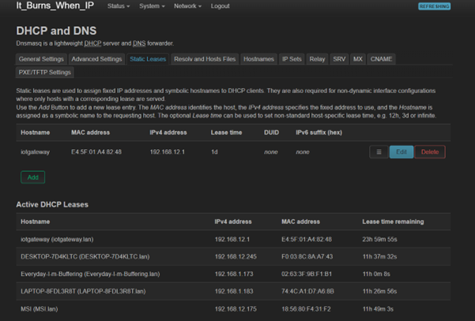
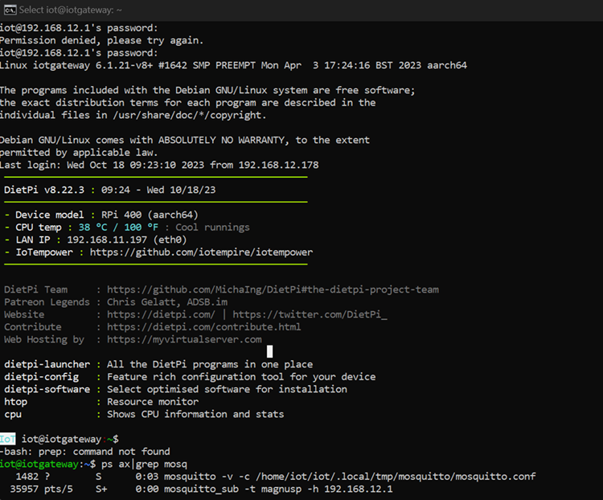
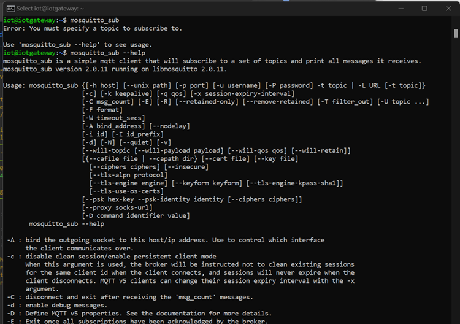

# Lab Tasks Description

# Exercise 03

For the third exercise we followed the lab task documentation.

## Before Addressing the Exercises

Before we delved into the exercises, a persisting issue with the Raspberry Pi came to our attention. This issue involved frequent crashes while attempting to connect to the Wi-Fi network. This predicament severely impeded our progress, leaving us unable to work effectively. After consulting with Ulrich, a unanimous decision was made to disable the Wi-Fi functionality on the Raspberry Pi. The following steps detail how we rectified this situation, with Ulrich taking the lead in adjusting the Raspberry Pi settings:

1. We initiated the resolution process by shutting down the Raspberry Pi router before powering it back on.

2. Subsequently, the router's LAN address was reconfigured to 192.168.12.254.

3. Upon restarting the Raspberry Pi, we accessed the router settings and assigned a static IP address (192.168.12.1) to the Raspberry Pi.

4. An SSH connection was established to the Raspberry Pi, and the command "sudo reboot" was issued.

5. Consequently, the Raspberry Pi was assigned the IP address 192.168.12.1.



### Example - The Initial Exercise

With the Raspberry Pi now successfully configured, it has been assigned the unique identifier of 192.168.12.1, enabling us to connect to and communicate with it within our network.

To configure the MQTT Mosquitto settings on our Raspberry Pi, SSH proved to be indispensable. SSH allowed us to remotely access the Raspberry Pi, facilitating the configuration of MQTT Mosquitto settings.



For accessing Mosquitto's message subscription options, you can simply employ the following command in your terminal:

```bash
mosquitto_sub --help
```

Running this command will provide an exhaustive list of available parameters and usage guidelines, making it straightforward to subscribe to MQTT messages.



To explore Mosquitto's message publishing options, the following command can be utilized in your terminal:

```bash
mosquitto_pub --help
```

Executing this command will furnish you with an exhaustive list of available parameters and usage instructions, making the process of publishing messages using MQTT exceptionally user-friendly.


